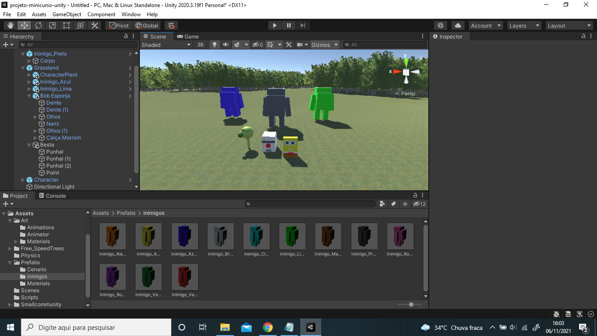

# Projeto Minicurso Unity

## Ministrante: 
 - Ariel Madril 
 
## Grupo: 
 - David Junior Rodrigues - 181257629
 - David Hiromi Ono - 181254964
 - Pedro Henrique Zago Costa - 181257084
 
## Data do Curso: 
 - 03/11/2021 - 05/11/2021 às 19h até 22h
 - 06/11/2021 às 14h até 18h
 
## Ideia Base apresentado no Curso: 
Ariel apresentou um personagem principal, duas armas e um inimigo. Fazendo um jogo de tiro em terceira pessoa. 
Além disso, foi feito alguns scripts, tais como: 
 - Fazer o Inimigo se mover; 
 - Bala Atirar; 
 - Personagem Principal se mover;
 - Inimigos surgirem até atingir a quantidade 10; 

 # Nosso Projeto: 
 Acrescentamos dois diferentes personagens principais (Bob Esponja e a Planta - o Jogador pode escolher entre eles, além do Personagem criado pelo Ariel) e mais um Inimigo (os Monstros/Among Us maiores) que existem em diversas cores. Além de criarmos uma Besta (arma) e um cenário de fundo. Logo, esse jogo em terceira pessoa pode ter diferentes variações de personagens, armas e inimigos.

 
 Em relação ao jogo, modificamos o script que mantinha sempre 10 inimigos no jogo e fizemos que ele acrescentasse um inimigo a cada 3 segundos, isso até atingir 1 minuto de jogo. Além de fazermos que os inimigos que fossem surgindo variasse entre os monstros de diferentes cores e o inimigo criado pelo Ariel. 

 ## Implementações que não deram tempo: 
 
 - Fazer dois players; 
 - Colocar mais armas, como um canhão; 
 - Criar obstaculos;
 - Novos Cenários.

